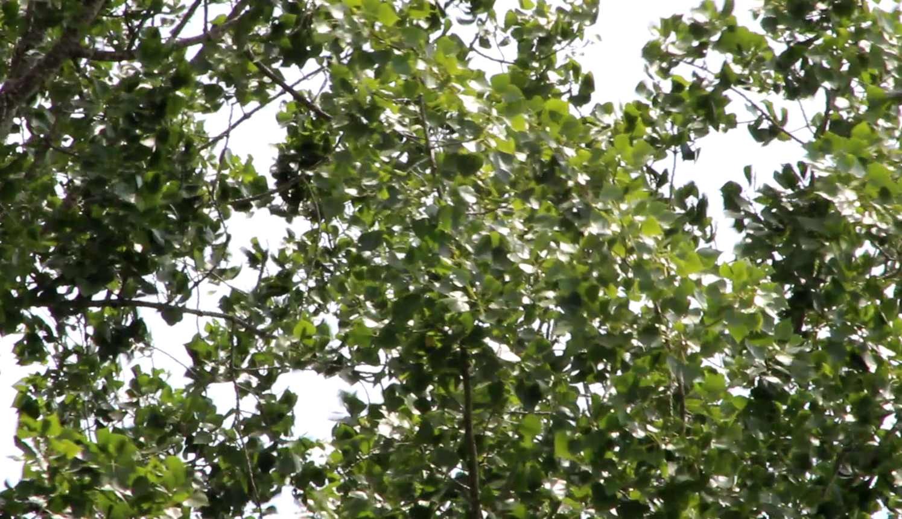
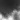
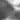

# Poplar randomness extractor

*Can we extract randomness from poplar leaves flickering in the wind?*

---

## Introduction

I have long admired the soft sparkle of poplar leaves, dancing in the wind. The stem of the poplar leaf being very thin, it can spin in the slightest breeze. This produces a shine that appears random. Tired of poetry, I wondered if it was possible to extract randomness from a video of poplars in the wind.

Randomness is particularly useful in computing, for example to generate cryptographic keys or for certain types of simulations. Most random generators are PRNGs (Pseudo Random Number Generators), meaning that a deterministic algorithm generates a series of pseudo-random numbers from a random seed.

Another less common method is to extract randomness from entropy sources external to the computer system. These sources can be quantum, atmospheric phenomena or even [lava lamps](https://www.cloudflare.com/learning/ssl/lava-lamp-encryption/). All methods that take randomness from an external source require an entropy extraction algorithm, to ensure that the distribution of output bits meets the requirements of a random sequence.

Here we seek to extract randomness from a source of entropy external to the information system, the sparkle of poplar leaves caressed by the breeze.


*Fig.1: poplar leaves glistening in the breeze*

## Installation

You will need Python 3 to run this program. Personally I used Python 3.11.

```bash
pip install opencv-python
```

## Method

I started by filming some poplar branches, you can find the videos in the *poplar_videos* folder.

Since we are interested in flicker, and therefore brightness, the video is converted to grayscale.

From there, I thought of several methods to extract randomness. For example, we could search for the position of the brightest pixel every second.

I chose another simpler method: I defined a small "Region Of Interest" (ROI), 20 x 20 px, in which the flicker looks particularly determined. Then, I look for the average of each pixel at each frame. I add these averages over each second, and if this result is greater than the previous second, I return **1**, **0** otherwise.

|  |  |
|---------------------------------------|---------------------------------------|

*Fig.2: 20 x 20 px ROI frames*

## Results

Since we are extracting 1 bit per second, our output sample is the duration of the video in seconds. As the latter is quite short, our sample is quite small (39 bits).

The output bits are roughly balanced, with about 50% 1s and 50% 0s. However, the probability of one bit does not seem perfectly independent of the previous bit. This phenomenon is due to the fact that in addition to making the leaves sparkle, the wind makes the branches sway. Thus, when a branch passes through our ROI, the total luminosity gradually decreases, then increases again.


I tried changing the ROI size or sampling rate. If we observed a slight difference, the basic problem remained.

Here are some ideas I can think of to eliminate this phenomenon:
- Pass the series of brightness values from the ROI through a high pass filter (HPF), in order to eliminate the effect of slowly swinging branches (and clouds passing in front of the sun). This method would perhaps also allow us to reduce the sampling time window. However, we would need more sample to test this hypothesis.
- Film our poplar at a time when the wind is a little less strong. You have to choose the moment carefully so that the leaves continue to sparkle properly, and that the sun is strong enough for the sparkling to stand out. This solution has the drawback of being difficult to apply in an industrial context.
- Pass our output bits into an entropy extraction or hash function, like a Toeplitz matrix.

I think the solution that would give the best result would be the high pass filter followed by the entropy extraction function. In order to generate more output bits in the same time interval, I think it would be wise to have several Regions Of Interest sufficiently spaced on the same poplar, so that their outputs are independent.

## Conclusion

In conclusion, it was possible to generate a series of balanced bits from a video of poplar leaves shimmering in the breeze. We defined a small Region Of Interest (ROI) where the flickering seemed particularly interesting. We then generated our output bits from the brightness variation in this small region.

Our output bits were not perfectly random, however. We have proposed solutions to try to overcome this problem.

In addition, our generator has the drawback of being extremely slow compared to existing solutions. Each ROI can generate 1 bit per second, while PRNGs can generate several hundred Mbits per second.

## Discussion

It would be interesting to validate our generator with statistical tests like NIST or testu01. This would however require a much larger sample size, of the order of several million bits at least. So it would take a lot of poplar videos, divided into a lot of ROIs.

It would also be interesting to further study the effects of wind on poplars, particularly on the swaying of branches and the flickering of leaves. This would allow us to approximate the min-entropy of our generator.

**If you would like to contribute to this project or suggest ideas, please do not hesitate to contact me, for example via the GitHub Issues of this repository.**

### References

```
[...]

La respiration douce
Des bois au milieu du jour
Donne une lente secousse
A la vague, au brin de mousse,
Au feuillage d’alentour.

Seul et la cime bercée,
Un jeune et haut peuplier
Dresse sa flèche élancée,
Comme une haute pensée
Qui s’isole pour prier.

Par instants, le vent qui semble
Couler à flots modulés
Donne à la feuille qui tremble
Un doux frisson qui ressemble
A des mots articulés.

L’azur où sa cime nage
A balayé son miroir,
Sans que l’ombre d’un nuage
Jette au ciel une autre image
Que l’infini qu’il fait voir.

[...]
```
(Alphonse de Lamartine, *Cantique sur un rayon de soleil*)